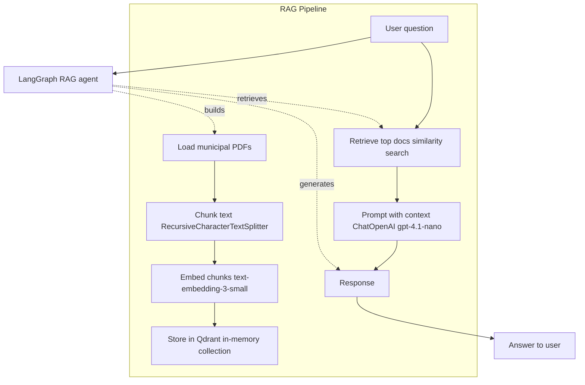

```mermaid
flowchart TD
    U[User question] --> RAG[LangGraph RAG agent]

    subgraph "RAG Pipeline"
        A[Load municipal PDFs] --> B[Chunk text RecursiveCharacterTextSplitter]
        B --> C[Embed chunks text-embedding-3-small]
        C --> D[Store in Qdrant in-memory collection]
        U --> E[Retrieve top docs similarity search]
        E --> F[Prompt with context ChatOpenAI gpt-4.1-nano]
        F --> G[Response]
    end

    RAG -.builds.-> A
    RAG -.retrieves.-> E
    RAG -.generates.-> G
    G --> OUT[Answer to user]
```

