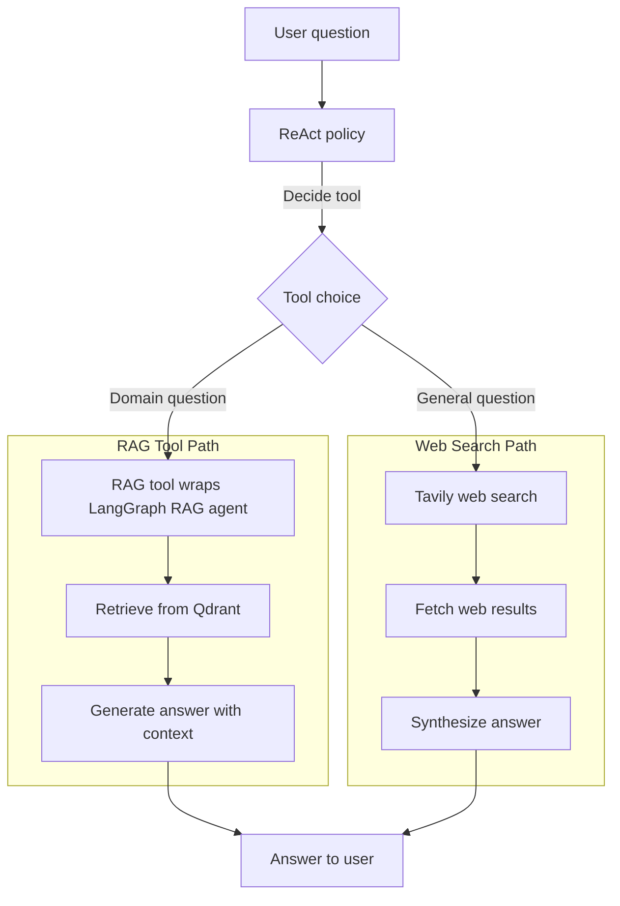

```mermaid
flowchart TD
    U[User question] --> P[ReAct policy]
    P -->|Decide tool| CH{Tool choice}
    CH -->|Domain question| RAG_Tool[RAG tool wraps LangGraph RAG agent]
    CH -->|General question| Tavily[Tavily web search]

    subgraph "RAG Tool Path"
        RAG_Tool --> A[Retrieve from Qdrant]
        A --> B[Generate answer with context]
    end

    subgraph "Web Search Path"
        Tavily --> C[Fetch web results]
        C --> D[Synthesize answer]
    end

    B --> ANS[Answer to user]
    D --> ANS
```

