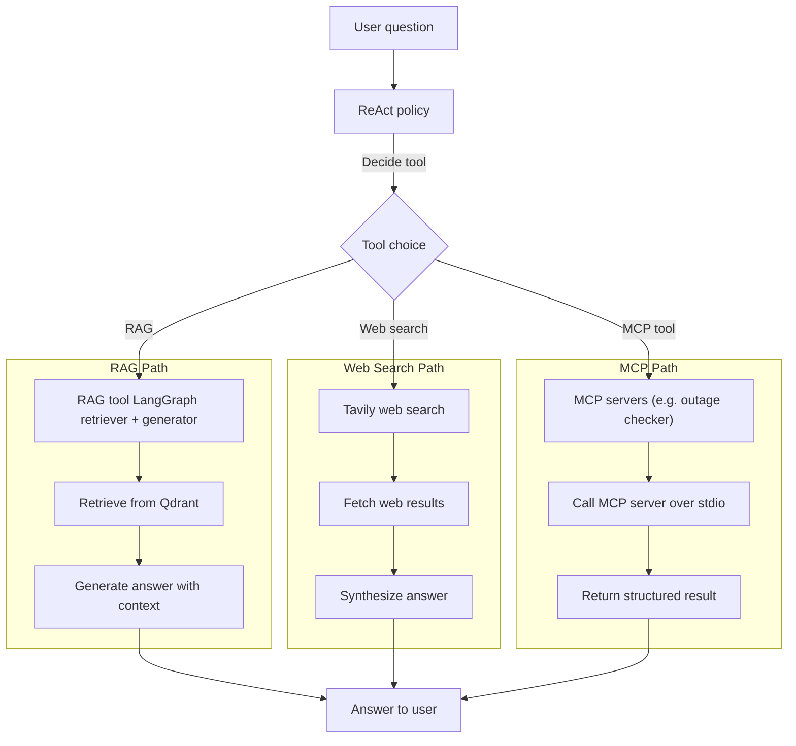

```mermaid
flowchart TD
    U[User question] --> P[ReAct policy]
    P -->|Decide tool| CH{Tool choice}
    CH -->|RAG| RAG_Tool[RAG tool LangGraph retriever + generator]
    CH -->|Web search| Tavily[Tavily web search]
    CH -->|MCP tool| MCP["MCP servers (e.g. outage checker)"]

    subgraph "RAG Path"
        RAG_Tool --> A[Retrieve from Qdrant]
        A --> B[Generate answer with context]
    end

    subgraph "Web Search Path"
        Tavily --> C[Fetch web results]
        C --> D[Synthesize answer]
    end

    subgraph "MCP Path"
        MCP --> E[Call MCP server over stdio]
        E --> F[Return structured result]
    end

    B --> ANS[Answer to user]
    D --> ANS
    F --> ANS
```

